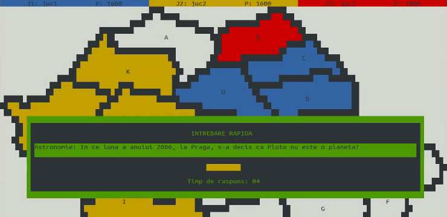

# CRRIFC

This is a multiplayer map-based quiz game (ConQUIZtador clone) written in C for
Linux.

I wrote this in my first year (2009) before doing network programming so it
doesn't use sockets, but rather named pipes. This means it would only work on
the same computer. This was my intent since I wrote it in order to run it on
Fenrir (the students' server of my faculty).

Sadly this repo is missing the data files since I'm not sure I should make them
public, but you can ask me for them.

[Demo on YouTube][1]:

[][1]

## The protocol

This is what I documented of it back then (in Romanian).

### Ce trimite clientul

* `CONE +1` - conectare si numele de utilizator (<=12 caractere
* `TRIR +1` - trimit raspunsul pentru intrebarea rapida x
* `TRIG +1` - trimit raspunsul pentru intrebarea grila: varianta
* `ALEG +1` - aleg teritoriul x
* `ATAC +1` - atac teritoriul x

### Ce trimite serverul

* `AIIN +0 s` - ai intrat pe server
* `SNTJ +1`   - sunt n jucatori
* `JUCS +3`   - jucatorii sunt x, y,
* `PUNS +3`   - punctele sunt x, y, z
* `INTR +1`   - intrebare rapida: x
* `INTG +5`   - intrebare grila: x . varianta 1: y varianta 2: z ...
* `RASR +4`   - raspunsul pentru intrebarea rapida era x. j1 a zis y, j2 ...
* `RASG +4`   - raspunsul pentru intrebarea grila era varianta x; j1 a zis y ...
* `JALG +1`   - jucatorul x trebuie sa aleaga un teritoriu
* `TBAL >1 s` - trebuie sa alegi un teritoriu dintre x, y, z, ...
* `JALT +2`   - jucatorul x a ales teritoriul y
* `JATC +1`   - jucatorul x trebuie sa atace un teritoriu
* `TBAT >1 s` - trebuie sa ataci un teritoriu dintre x, y, ...
* `JATT +2`   - jucatorul x a ales sa atace teritoriul y

## License

MIT

[1]: http://www.youtube.com/watch?v=QlaqZcl0R_A
